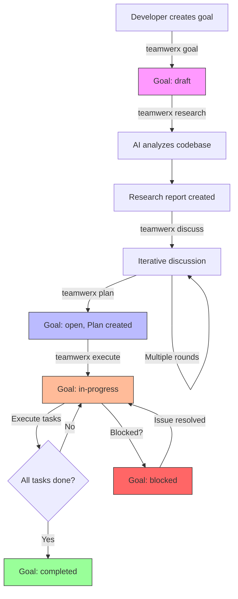

# teamWERX

A development framework for individual developers working with multiple AI agents.

## Overview

teamWERX is a command-line interface (CLI) tool that provides a structured workflow to bring clarity, predictability, and efficiency to the software development lifecycle by coordinating the developer and their AI assistants around shared goals and plans.

## Core Philosophy

- **Goal-Oriented**: Development starts with clear definitions of high-level goals and desired outcomes
- **Specification-Driven**: Goals are translated into concrete specifications through research and discussion with AI agents
- **Multi-Agent Coordination**: The framework orchestrates multiple AI agents working on different aspects of a project, all guided by a single developer
- **Traceability**: All decisions, discussions, and plans are documented and version-controlled, providing a clear audit trail
- **Non-Destructive**: All commands append to existing artifacts rather than overwriting them, preserving full history in git

## Features

- **Goal-Oriented Development**: Start with clear, measurable goals
- **AI Agent Coordination**: Work with multiple AI agents on different aspects of your project
- **Git-Based Versioning**: All artifacts tracked in git for complete traceability
- **Structured Workflow**: Research → Discussion → Planning → Execution
- **Multi-Goal Support**: Work on multiple goals concurrently
- **Numbered Workspaces**: Deterministic numbering for goals, tasks, and discussions

## Installation

```bash
npm install -g teamwerx
```

Or use locally in your project:

```bash
npm install --save-dev teamwerx
```

## Quick Start

```bash
# Install and initialize
npm install -g teamwerx
cd my-project && git init
teamwerx init

# Create and develop a goal
teamwerx goal "Implement user authentication"
teamwerx use implement-user-authentication
teamwerx research
teamwerx discuss "Should we use JWT or sessions?"
teamwerx plan
teamwerx execute
```

## Workflow

The teamWERX workflow is divided into main phases. Multiple goals can progress through these phases concurrently, with different AI agents potentially working on different goals under the developer's direction.

1. **Goal Setting**: The developer defines the high-level goals for the project or feature
2. **Research**: The AI agent analyzes the codebase and generates a research report
3. **Discussion**: The developer and AI agents discuss potential implementation strategies
4. **Planning**: Based on the research and discussion, a detailed implementation plan is created
5. **Execution**: The plan is executed by AI agents under the developer's guidance
6. **Change Management**: Changes to goals and plans can be proposed and tracked

### Workflow Visualization



**Key Points:**
- Goals start in `draft` state and progress through research and planning
- The discussion phase is iterative (multiple rounds possible)
- Execution moves the goal to `in-progress`
- Tasks are executed one-by-one until all complete
- Goals can be blocked and later unblocked

## Commands

All commands are **non-destructive**. Instead of overwriting existing artifacts, they append new entries or create new files so prior context remains available in git history.

### Initialization

**`teamwerx init`**

Initializes teamWERX in the current project. This command:
- Verifies that the current directory is a git repository (fails if not)
- Creates the `.teamwerx` directory structure
- Creates template directories for goals and proposals
- Creates or updates `AGENTS.md` with teamWERX configuration in YAML frontmatter

**Prerequisites:**
- The project must be initialized as a git repository (`git init`)
- The command must be run from the project root directory

### Goal Management

**`teamwerx goal [description]`**

Creates a new goal with automatic workspace setup. Prompts for success criteria if not provided. Saves:
- Goal file to `.teamwerx/goals/[kebab-case-title].md`
- Creates numbered workspace `.teamwerx/goals/00X-[slug]/` with discussion, plan, and research templates

**`teamwerx list [--status <status>]`**

Lists all goals in the project with optional filtering by status.

**`teamwerx status [goal-name] [--context] [--summary]`**

Shows detailed status of a goal (or all goals if omitted).
- Default: Goal status, success criteria, plan info
- `--context`: Tech stack, directories, artifacts
- `--summary`: Discussion/implementation counts, recent records

**`teamwerx use <goal-name>`**

Sets the current working goal context. Stores selection in `.teamwerx/.current-goal`.

### Research and Discussion

**`teamwerx research [goal-name] [--goal <goal>]`**

Analyzes the codebase and generates/updates research report. Detects technology stack, languages, and directory structure. Updates `research.md` in goal workspace.

This command is designed to be executed by an AI agent.

**`teamwerx discuss <message> [--goal <goal>]`**

Appends a numbered discussion entry (D01, D02, ...) with timestamp and content to the goal's discussion log. Non-destructive; preserves all prior entries.

This command is designed to be executed by an AI agent.

**`teamwerx dry-run [--goal <goal>] [--notes <text>]`**

Records a dry-run assessment in the discussion log, outlining expected file changes, risks, and dependencies.

This command is designed to be executed by an AI agent.

### Planning and Execution

**`teamwerx plan [considerations] [--goal <goal>] [--task <task>] [--interactive]`**

Adds numbered tasks (T01, T02, ...) to the goal plan.
- Use `--task` flag for individual tasks
- Use `--interactive` for prompted entry
- Use no flags for AI-driven planning mode

This command is designed to be executed by an AI agent.

**`teamwerx execute [goal-name]`**

Executes tasks from the plan:
1. Read plan, identify next pending task
2. Implement task (create/modify code files)
3. Update task status to completed in plan file
4. Prompt developer to commit

If `goal-name` is provided, uses that goal; otherwise uses current goal.

This command is designed to be executed by an AI agent.

### Workspace Management

**`teamwerx collect [--goal <goal>] [--title <title>]`**

Collects staged git changes. Adds a completed plan task and creates `implementation/TXX.md` with diff summary and details.

**`teamwerx charter`**

Generates or refreshes `.teamwerx/goals/charter.md` based on detected technology stack and governance constraints.

**`teamwerx correct <issue> [--goal <goal>]`**

Logs an issue fix: adds a discussion entry, creates a completed task, and writes an implementation record describing the resolution.

**`teamwerx implement [--goal <goal>] [--notes <text>]`**

Batch-completes up to five pending tasks and creates implementation records for each.

**`teamwerx inspire [--goal <goal>]`**

Analyzes pending work and adds a discussion entry highlighting decision points or follow-up questions.

### Change Management

**`teamwerx propose <description>`**

Proposes a change to a goal or plan. Saves to `.teamwerx/proposals/[goal-name]/[proposal-id].md` with frontmatter (title, type, target, status, created, rationale).

Proposals are reviewed manually—update the proposal file's `status` (e.g., `approved`, `rejected`) and rationale directly once a decision is made.

**`teamwerx archive [goal-name] [--yes]`**

Archives a completed goal (defaults to the current goal). Moves goal file, workspace, and artifacts to `.teamwerx/archive/`. Use `--yes` to skip confirmation.

## Project Structure

After initialization, teamWERX creates the following structure:

```
project-root/
├── AGENTS.md              # Configuration + AI agent instructions
└── .teamwerx/
    ├── goals/
    │   ├── goal-name.md             # Goal definition file
    │   ├── 001-goal-name/           # Numbered workspace
    │   │   ├── discuss.md           # Discussion log (D01, D02, ...)
    │   │   ├── plan.md              # Task plan (T01, T02, ...)
    │   │   ├── research.md          # Research report
    │   │   └── implementation/      # Implementation records (T01.md, T02.md, ...)
    │   ├── 002-another-goal/
    │   ├── charter.md               # Project charter
    │   └── registry.json            # Workspace numbering registry
    ├── proposals/                   # Change proposals
    ├── archive/                     # Archived goals and workspaces
    └── .current-goal                # Current working goal
```

### Structure Details

Each goal has two parts:
1. **Goal file** (`goal-name.md`) - Metadata, success criteria, and notes
2. **Numbered workspace** (`00X-goal-name/`) - Discussion, plan, research, and implementation records

**Workspace numbering:**
- Goals get sequential three-digit IDs (`001`, `002`, ...) tracked in `registry.json`
- Discussion entries use `D01`, `D02`, ...
- Tasks use `T01`, `T02`, ...
- Implementation records match task IDs (`T01.md`, `T02.md`, ...)

**Files to commit:**
- `.teamwerx/goals/` (goal files and workspaces)
- `.teamwerx/proposals/`
- `.teamwerx/archive/`
- `AGENTS.md`

**Files to ignore:**
- `.teamwerx/.current-goal` (local state)
- `.teamwerx/.temp/` (temporary files)

## Configuration

Configuration is stored in `AGENTS.md` frontmatter at the project root:

```yaml
---
teamwerx:
  version: "1.0.0"
  initialized: "2025-10-25"
---
```

**Configuration Fields:**
- `version`: teamWERX specification version
- `initialized`: ISO 8601 date when teamWERX was initialized

**Note on Token Efficiency:** The configuration is intentionally minimal because `AGENTS.md` is read by AI agents with every command execution. Additional settings are defined as conventions in the specification rather than configuration.

## Working with AI Agents

teamWERX is designed to work seamlessly with AI coding assistants. The `AGENTS.md` file provides instructions that AI agents can read and follow.

When you run commands like `teamwerx research` or `teamwerx plan`, the AI agent should:
1. Read the relevant sections of `AGENTS.md`
2. Perform the requested analysis or action
3. Save the results to the appropriate location

**AI-agnostic design:** teamWERX doesn't call AI APIs. AI agents read `AGENTS.md` to understand commands and execute accordingly.

## Goal States

Goals progress through the following states:

- **draft** - Initial state when created, under refinement
- **open** - Ready for work but not yet started
- **in-progress** - Active work being done
- **blocked** - Temporarily halted due to dependencies or issues
- **completed** - Success criteria met
- **cancelled** - Abandoned

**State transitions:** Update the `status` field in the goal's frontmatter manually, then commit to git.

**Plan/Task states:**
- Plans: `pending` → `in-progress` → `completed` (or `blocked`)
- Tasks: `pending` → `in-progress` → `completed`
- Plan status automatically reflects task statuses

## Schemas

All artifacts use YAML frontmatter for machine-readability.

### Goal Schema

| Field | Type | Required | Description |
|-------|------|----------|-------------|
| `title` | string | ✓ | Brief, descriptive name |
| `status` | enum | ✓ | draft \| open \| in-progress \| blocked \| completed \| cancelled |
| `created` | date | ✓ | ISO 8601 date (YYYY-MM-DD) |
| `success_criteria` | array | ✓ | List of measurable outcomes |
| `dependencies` | array | - | Goal IDs that must complete first (optional) |

### Plan Schema

| Field | Type | Required | Description |
|-------|------|----------|-------------|
| `goal` | string | ✓ | Goal file reference (without .md) |
| `goal_number` | string | ✓ | Workspace number (e.g., "001") |
| `updated` | date | ✓ | ISO 8601 timestamp |
| `tasks` | array | ✓ | Task objects with id, title, status, notes, source |

**Task object:** `{id: string, title: string, status: string, notes: string, source: string, created: string, updated: string}`

### Proposal Schema

| Field | Type | Required | Description |
|-------|------|----------|-------------|
| `title` | string | ✓ | Brief description of proposed change |
| `type` | enum | ✓ | goal-change \| plan-change |
| `target` | string | ✓ | Goal or plan ID this affects |
| `status` | enum | ✓ | pending \| approved \| rejected |
| `created` | date | ✓ | ISO 8601 date (YYYY-MM-DD) |
| `rationale` | string | ✓ | Why this change is proposed |

## Multi-Goal Development

teamWERX supports unlimited concurrent goals, each with independent workflows. Different AI agents can work on different goals in parallel.

**Goal identification:** Kebab-case filenames (e.g., `implement-new-login-page.md`)

**Context management:**
- `teamwerx use [goal-name]` - Set current working goal (stored in `.teamwerx/.current-goal`)
- `teamwerx list [--status=<status>]` - List/filter all goals
- `teamwerx status [goal-name]` - Show detailed goal status

**Dependencies:** Add `dependencies` field in goal frontmatter to track prerequisite goals

**Multi-Agent Coordination:**
```bash
# Agent A (session 1)
teamwerx use goal-a
teamwerx research
teamwerx execute

# Agent B (session 2, different terminal)
teamwerx use goal-b
teamwerx research
teamwerx execute

# Check all goals
teamwerx list
```

## Common Workflows

### Complete Goal Lifecycle

```bash
# Create a goal
teamwerx goal "Add payment integration"

# Set as current goal
teamwerx use add-payment-integration

# AI agent analyzes codebase
teamwerx research

# Discuss implementation approach (multiple rounds)
teamwerx discuss "Should we use Stripe or PayPal?"
teamwerx discuss "Let's go with Stripe for better API support"

# AI agent generates plan
teamwerx plan

# AI agent executes tasks
teamwerx execute

# Archive when complete
teamwerx archive add-payment-integration

# Commit after each major step
git add . && git commit -m "[teamWERX] Complete payment integration"
```

### Managing Multiple Goals

```bash
# List all goals
teamwerx list

# Filter by status
teamwerx list --status=in-progress

# Check status of specific goal
teamwerx status add-payment-integration

# Switch between goals
teamwerx use authentication-feature
```

### Change Management

```bash
# Propose a change
teamwerx propose "Switch authentication to OAuth2"

# Review proposal (manual)
# Edit .teamwerx/proposals/authentication/proposal-001.md
# Set status: approved/rejected, add rationale

# If approved, update plan
teamwerx plan
```

## Best Practices

### Git Workflow

- Commit after each major change (goal creation, plan updates, task completion)
- Use `[teamWERX]` prefix for commit messages
- Tag important milestones with git tags
- Create branches for experimental goals

Example:
```bash
git add .teamwerx/
git commit -m "[teamWERX] Add authentication goal"
```

### Goal Management

- Use clear, distinctive goal names to avoid confusion between agents
- Track dependencies in goal frontmatter when goals depend on each other
- Regularly review all goals with `teamwerx list`
- Archive completed goals to keep workspace focused
- Limit number of goals in `in-progress` state simultaneously

### Multi-Agent Coordination

- Each agent works on one goal at a time (set with `teamwerx use`)
- Use separate terminal sessions/IDEs for different agents
- Review overall status with `teamwerx list` before switching contexts
- Document blockers in goal status when work is halted

### Research & Discussion

- Run `teamwerx research` once per goal (initial analysis)
- Use `teamwerx discuss` for iterative conversations (multiple rounds)
- Follow recommended flow: goal → research → discuss → plan → execute → archive

### Workspace Management

- Use `teamwerx collect` to capture manual changes into the plan
- Use `teamwerx correct` to log issue fixes
- Use `teamwerx implement` to batch-complete tasks
- Keep `plan.md`, `discuss.md`, `research.md`, and `implementation/` synchronized with actual work

## Error Handling

Commands provide clear, actionable error messages that include:
1. What went wrong
2. How to fix it
3. Relevant context (available options, next steps)

**Common error categories:**
- Prerequisites not met (git not initialized, teamWERX not initialized)
- Resource not found (invalid goal/task/proposal ID)
- State errors (no current goal set, no pending tasks)

## Proposal Workflow

A **proposal** is a suggested change to a goal or a plan. It provides a structured way to propose changes and track the decision-making process.

**Recommended workflow:**

1. Create a proposal using `teamwerx propose`
2. The proposal is saved with status `pending`
3. Review the proposal and provide feedback
4. Update the proposal file directly, setting `status` to `approved` or `rejected` and documenting the rationale
5. If approved, apply changes to the corresponding goal or plan, then archive the proposal
6. If rejected, archive the proposal (with rejection rationale) for future reference

## Archiving

Use `teamwerx archive [goal-name]` to move completed work out of the active workspace:

1. The CLI looks up the goal (defaults to the current goal)
2. It shows a summary of artifacts to be moved and asks for confirmation unless `--yes` is provided
3. Each artifact is moved into `.teamwerx/archive/<type>/`, automatically appending suffixes if files already exist
4. If the archived goal was the current goal, `.teamwerx/.current-goal` is cleared

Archived goals no longer appear in `teamwerx list`, but they remain in `.teamwerx/archive/` (and git history) for auditing.

## Version Tracking

teamWERX uses git-based versioning for all artifacts.

**Version references:** Commit SHAs, tags, or branches (e.g., `a1b2c3d`, `v1.0.0`, `HEAD~1`)

**Examples:**

```bash
# View git history for a goal
git log -- .teamwerx/goals/my-goal.md

# Compare revisions directly with git
git diff HEAD~1 -- .teamwerx/goals/my-goal.md

# View changes to a workspace
git log -- .teamwerx/goals/001-my-goal/
```

## Extensibility

teamWERX is designed to be extensible. Users can add new commands and new types of artifacts to the framework.

- **New commands**: Create a new JavaScript file in the `lib/commands/` directory
- **New artifact types**: Create a new directory in the `.teamwerx/` directory

The CLI source includes reusable templates (e.g., `AGENTS.md`) under `assets/templates/`.

## Requirements

- Node.js >= 14.0.0
- Git (must be initialized in your project)

## License

MIT

## Contributing

Contributions welcome! Please read this README for detailed information about the architecture and design.

## Support

For issues and questions, please file an issue on GitHub.
