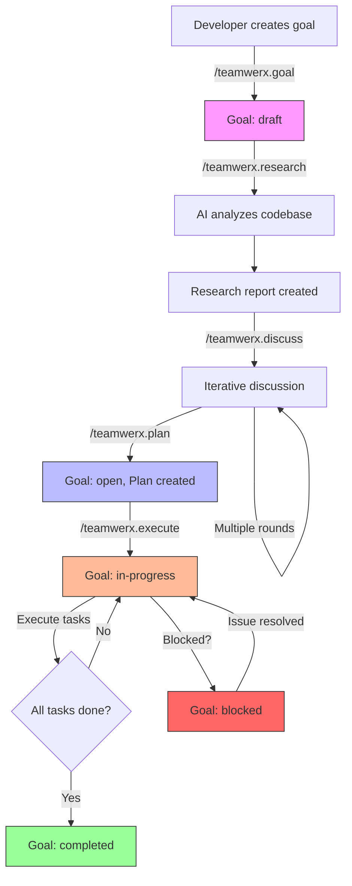
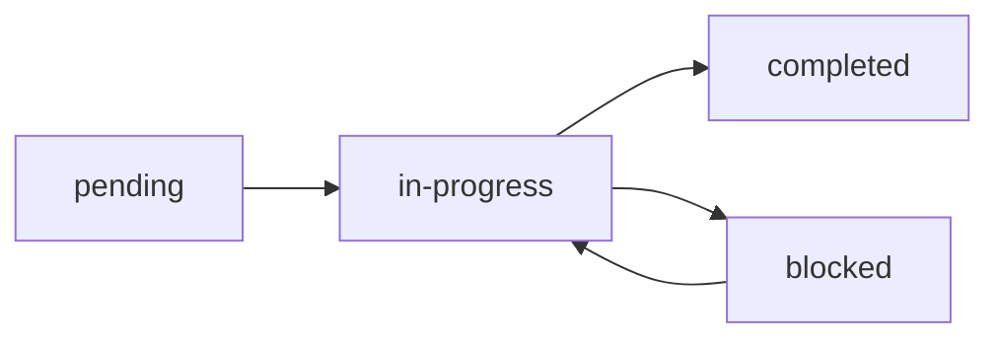
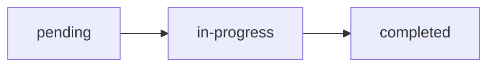

# teamWERX Specification

## Introduction

teamWERX is a development framework for individual developers working with multiple AI agents. It provides a structured workflow to bring clarity, predictability, and efficiency to the software development lifecycle by coordinating the developer and their AI assistants around shared goals and plans.

## Core Philosophy

*   **Goal-Oriented:** Development starts with a clear definition of high-level goals and desired outcomes.
*   **Specification-Driven:** Goals are translated into concrete specifications through a process of research and discussion with AI agents.
*   **Multi-Agent Coordination:** The framework orchestrates multiple AI agents working on different aspects of a project, all guided by a single developer.
*   **Traceability:** All decisions, discussions, and plans are documented and version-controlled, providing a clear audit trail.
*   **Token-Efficient:** Agent instructions are designed to minimize token usage while providing complete context.

## Quick Start

### Installation

```bash
npm install -g teamwerx
```

### Initialize a Project

```bash
cd my-project
git init  # teamWERX requires git
teamwerx init
```

This creates the `.teamwerx` directory structure and initializes the `AGENTS.md` file with configuration.

### Create Your First Goal

```bash
# Create a new goal
teamwerx goal "Implement user authentication"

# AI agent will prompt for success criteria, then create the goal file
```

### Research and Plan

```bash
# Analyze the codebase (AI agent does the work)
teamwerx research

# Discuss implementation approach
teamwerx discuss "Should we use JWT or session-based auth?"

# Generate implementation plan
teamwerx plan
```

### Execute Tasks

```bash
# Execute tasks one by one
teamwerx execute 1
teamwerx execute 2

# Or execute next pending task
teamwerx execute
```

### Typical Multi-Agent Session

```bash
# Morning: Start work on authentication with Agent A
teamwerx use implement-auth
teamwerx status implement-auth  # Review what's left
teamwerx execute 3              # Execute task 3

# Afternoon: Switch to payment feature with Agent B (different session/agent)
teamwerx use add-payment
teamwerx execute 1              # Execute first payment task

# Review all goals
teamwerx list
```

## Technical Architecture

teamWERX will be built as a command-line interface (CLI) tool using Node.js. It will be distributed via npm, allowing for easy installation and integration into existing projects. The CLI will provide a set of slash commands for interacting with the framework.

## Workflow

The teamWERX workflow is divided into four main phases. Multiple goals can progress through these phases concurrently, with different AI agents potentially working on different goals under the developer's direction.

1.  **Goal Setting:** The developer defines the high-level goals for the project or feature.
2.  **Research and Discussion:** The developer and AI agents research the existing codebase, discuss potential implementation strategies, and refine the requirements.
3.  **Planning:** Based on the research and discussion, a detailed implementation plan is created.
4.  **Execution:** The plan is executed by AI agents under the developer's guidance.
5.  **Change Management:** Changes to goals and plans can be proposed and tracked throughout the development process.

**Note:** These phases are per-goal, meaning different goals can be in different phases simultaneously, with different AI agents working on different goals.

### Workflow Visualization

The following diagram shows the complete lifecycle of a goal in teamWERX:



**Key Points:**
*   Goals start in `draft` state and progress through research and planning
*   The discussion phase is iterative (multiple rounds possible)
*   Execution moves the goal to `in-progress`
*   Tasks are executed one-by-one until all complete
*   Goals can be blocked and later unblocked

### 1. Goal Setting

This phase is focused on defining the "why" and "what" of the project.

**Commands:**
*   `/teamwerx.goal`

### 2. Research and Discussion

This phase is focused on exploring the "how" of the project.

**Commands:**
*   `/teamwerx.research`
*   `/teamwerx.discuss`

**Research vs Discussion - Understanding the Difference:**

These two commands serve distinct purposes in the workflow:

**`/teamwerx.research`** - Initial Codebase Analysis
*   **Purpose**: One-time analysis of the existing codebase for the current goal
*   **When**: Execute once after creating a goal, before planning
*   **Output**: Structured report in `.teamwerx/research/[goal]/report.md`
*   **AI Action**: Read and analyze codebase, identify relevant files/functions/patterns, document findings
*   **Example**: "Analyze the existing authentication system and identify integration points"

**`/teamwerx.discuss [message]`** - Iterative Conversation
*   **Purpose**: Multi-round conversation to refine implementation approach
*   **When**: After research, potentially multiple times before planning
*   **Output**: Appends to `.teamwerx/research/[goal]/discussion.md`
*   **AI Action**: Respond to developer's questions, propose alternatives, provide feedback
*   **Example**: `/teamwerx.discuss "Should we use JWT or session-based auth?"`

**Recommended Flow:**
```bash
teamwerx goal "Implement authentication"
teamwerx research                              # AI analyzes codebase once
teamwerx discuss "Which auth library works best with our stack?"
teamwerx discuss "How should we handle refresh tokens?"
teamwerx discuss "Let's proceed with JWT and refresh tokens"
teamwerx plan                                  # Generate implementation plan
```

### 3. Planning

This phase is focused on creating a detailed implementation plan.

**Commands:**
*   `/teamwerx.plan`

### 4. Execution

This phase is focused on implementing the plan.

**Commands:**
*   `/teamwerx.execute`

### 5. Change Management

This phase is focused on managing changes to goals and plans.

**Commands:**
*   `/teamwerx.propose`
*   `/teamwerx.delta`
*   `/teamwerx.approve`
*   `/teamwerx.reject`

## Commands

### Initialization

*   `/teamwerx.init`: Initializes teamWERX in the current project. This command:
    *   Verifies that the current directory is a git repository (fails if not)
    *   Creates the `.teamwerx` directory structure
    *   Creates template directories for goals, research, plans, proposals, and deltas
    *   Creates or updates `AGENTS.md` with teamWERX configuration in YAML frontmatter
    *   Outputs a success message with next steps

**Prerequisites:**
*   The project must be initialized as a git repository (`git init` must have been run)
*   The command must be run from the project root directory

**Error Handling:**
*   If git is not initialized, the command will display: "Error: teamWERX requires a git repository. Please run 'git init' first."
*   If `.teamwerx` already exists, the command will ask: "teamWERX is already initialized. Do you want to reinitialize? (y/n)"
*   If `AGENTS.md` already exists, the command will preserve existing content and add/update only the frontmatter configuration

### Goal Setting

*   `/teamwerx.goal [goal description]`: Creates a new goal and prompts for success criteria. The description is a string that describes the goal.

### Goal Management

*   `/teamwerx.list [--status=<status>]`: Lists all goals in the project with optional filtering by status.
*   `/teamwerx.status [goal-name]`: Shows detailed status of a specific goal, or all goals if no name is provided.
*   `/teamwerx.use [goal-name]`: Sets the current working goal context for subsequent commands.

### Research and Discussion

*   `/teamwerx.research`: Analyzes the codebase and generates a research report, identifying relevant files, functions, and classes.
*   `/teamwerx.discuss [your message]`: Facilitates a structured discussion. The message is a string that contains your message.
*   `/teamwerx.dry-run`: Simulates the implementation plan to identify potential issues before execution.

### Change Management

*   `/teamwerx.propose [description]`: Propose a change to a goal or plan. The description is a string that describes the proposed change.
*   `/teamwerx.delta [artifact-path] [version1] [version2]`: View the changes between different versions of a goal or plan using git diff.

*   `/teamwerx.approve [proposal-id]`: Approve a proposal and merge its changes.
    *   Updates proposal status to `approved`
    *   Applies proposed changes to the target goal or plan
    *   Archives the proposal for reference
    *   Prompts developer to commit changes

**Example:**
```bash
$ teamwerx approve add-oauth-to-login

Approving proposal: add-oauth-to-login
Target: .teamwerx/goals/implement-login.md

Changes applied:
  - Added OAuth dependency to success criteria
  - Updated goal description

Proposal approved and archived.
Commit changes:
  git add .teamwerx/goals/implement-login.md .teamwerx/proposals/
  git commit -m "[teamWERX] Approve proposal: add OAuth to login"
```

*   `/teamwerx.reject [proposal-id] [reason]`: Reject a proposal.
    *   Updates proposal status to `rejected`
    *   Adds rejection rationale to the proposal
    *   Archives the proposal for future reference
    *   Does not modify the target goal or plan

**Example:**
```bash
$ teamwerx reject add-oauth-to-login "OAuth adds too much complexity for MVP"

Rejecting proposal: add-oauth-to-login
Reason: OAuth adds too much complexity for MVP

Proposal rejected and archived.
Commit changes:
  git add .teamwerx/proposals/
  git commit -m "[teamWERX] Reject proposal: add OAuth to login"
```

*   `/teamwerx.plan`: Generates a task list based on the research and discussion.

### Execution

*   `/teamwerx.execute [task-id]`: Executes a specific task from the current plan.
    *   If `task-id` is provided, executes that specific task
    *   If no `task-id` is provided, executes the next pending task
    *   Updates task status to `in-progress` → `completed`
    *   Prompts developer to review changes and commit

**Execution Flow:**
1. CLI reads the current plan from `.teamwerx/plans/[goal].md`
2. CLI identifies the task by ID (or finds next pending task)
3. CLI outputs task context for the AI agent
4. AI agent implements the task, creating or modifying code files
5. CLI updates task status to `completed` in the plan file
6. CLI prompts developer to review and commit changes

**Example:**
```bash
$ teamwerx execute 1

Executing Task 1: Create login form component
Goal: implement-auth
Plan: .teamwerx/plans/implement-auth.md

[AI agent creates LoginForm.tsx, adds tests, updates imports...]

Task 1 completed successfully.
Review changes and commit:
  git add .
  git commit -m "[teamWERX] Create login form component"
```

## Error Handling

teamWERX commands provide clear error messages to guide developers when issues occur.

### Common Error Cases

**No Current Goal Set:**
```
Error: No current goal set.

Use '/teamwerx.use <goal-name>' to set a working goal, or
use '/teamwerx.goal <description>' to create a new goal.

Available goals:
  - implement-auth
  - add-payment
```

**Goal Not Found:**
```
Error: Goal 'implement-xyz' not found in .teamwerx/goals/

Run '/teamwerx.list' to see available goals.
```

**Git Not Initialized:**
```
Error: This directory is not a git repository.

teamWERX requires git for versioning. Run 'git init' first.
```

**Plan Doesn't Exist:**
```
Error: No plan found for goal 'implement-auth'.

Run '/teamwerx.plan' to create an implementation plan first.
```

**Invalid Task ID:**
```
Error: Task ID '5' not found in plan.

Available tasks:
  1. Create login form component (pending)
  2. Implement authentication logic (pending)
  3. Add tests (pending)
```

**teamWERX Not Initialized:**
```
Error: teamWERX is not initialized in this project.

Run '/teamwerx.init' to set up teamWERX in this project.
```

**No Pending Tasks:**
```
Error: No pending tasks in plan 'implement-auth'.

All tasks are completed. Consider:
  - Marking the goal as completed
  - Creating a new goal with '/teamwerx.goal'
```

## Project Structure

teamWERX uses two main locations for its files:

1. **Project Root**: Contains `AGENTS.md` (configuration and agent instructions)
2. **`.teamwerx` Directory**: Contains all artifacts (goals, plans, research, etc.)

### Root Level
```
project-root/
├── AGENTS.md          # Configuration + AI agent instructions
└── .teamwerx/         # teamWERX artifacts directory
```

### `.teamwerx` Directory Structure

The `.teamwerx` directory is created in the root of the project to store all teamWERX artifacts:

```
.teamwerx/
├── goals/
│   ├── goal-1.md
│   └── goal-2.md
├── research/
│   ├── goal-1/
│   │   ├── report.md
│   │   └── discussion.md
│   └── goal-2/
│       ├── report.md
│       └── discussion.md
├── plans/
│   ├── goal-1.md
│   └── goal-2.md
├── proposals/
│   ├── goal-1/
│   │   ├── proposal-1.md
│   │   └── proposal-2.md
│   └── goal-2/
│       └── proposal-1.md
├── deltas/
│   ├── goal-1/
│   │   ├── delta-1.md
│   │   └── delta-2.md
│   └── goal-2/
│       └── delta-1.md
└── .current-goal
```
*   `goals/`: Contains the markdown files for each goal.
*   `research/`: Contains the research reports and discussion transcripts for each goal.
*   `plans/`: Contains the implementation plans for each goal.
*   `proposals/`: Contains change proposals for goals and plans.
*   `deltas/`: Contains version comparison reports.
*   `.current-goal`: Tracks the currently active goal (simple text file).

### Configuration

teamWERX configuration is stored in the `AGENTS.md` file at the project root. This file serves both as documentation for AI agents and as the configuration source for teamWERX behavior. By consolidating configuration into a human-readable markdown file, it ensures that the developer and all AI agents have a single source of truth.

**Location**: `AGENTS.md` (project root)

The configuration is defined using minimal YAML frontmatter at the top of the AGENTS.md file:

```yaml
---
teamwerx:
  version: "1.0.0"
  initialized: "2025-10-25"
---
```

**Configuration Fields:**
*   `version`: teamWERX specification version
*   `initialized`: ISO 8601 date when teamWERX was initialized

**Note on Token Efficiency:** The configuration is intentionally minimal because AGENTS.md is read by AI agents with every command execution. Additional settings are defined as conventions in the specification rather than configuration (e.g., default goal status is always "draft", git is always enabled, commits are always manual, commit prefix is always "[teamWERX]").

## Goals vs. Plans

A **goal** is a high-level, aspirational statement of what the project is trying to achieve. It's the "what" and the "why". It should be concise and easy to understand. A goal also has success criteria, which are used to determine whether the goal has been achieved.

A **plan** is a detailed, step-by-step description of how to achieve a goal. It's the "how". It should be a series of actionable tasks. A plan is generated from a goal through a process of research and discussion.

## Versioning Strategy

teamWERX uses git as its versioning system for all artifacts. This provides a robust, industry-standard approach to tracking changes and enables powerful version comparison capabilities.

### Version Tracking

*   **All artifacts are tracked in git**: Goals, plans, research reports, and proposals are stored in the `.teamwerx` directory and should be committed to git.
*   **Manual commits**: Users are responsible for committing changes to the `.teamwerx` directory. teamWERX does not auto-commit changes.
*   **Commit message convention**: It is recommended to prefix teamWERX-related commits with `[teamWERX]` for easy identification (e.g., `[teamWERX] Add new authentication goal`).

### Version References

*   **Git commit SHAs**: Versions are referenced using git commit SHAs (e.g., `a1b2c3d`).
*   **Git tags**: For major milestones, git tags can be used (e.g., `v1.0.0`, `goal-auth-complete`).
*   **Branch-based workflows**: Teams can use git branches for experimental goals or proposals.

### Delta Computation

The `/teamwerx.delta` command uses git to compute differences between versions:

*   **Command syntax**: `/teamwerx.delta <artifact-path> <version1> <version2>`
*   **Implementation**: Uses `git diff <version1> <version2> -- <artifact-path>` internally
*   **Output**: Displays a unified diff showing additions, deletions, and modifications
*   **Version formats supported**:
    *   Commit SHAs: `a1b2c3d` or full SHA
    *   Relative references: `HEAD`, `HEAD~1`, `HEAD~2`
    *   Tags: `v1.0.0`, `milestone-1`
    *   Branches: `main`, `feature/new-auth`

### Version History

Users can view the history of any artifact using standard git commands:

```bash
# View commit history for a specific goal
git log -- .teamwerx/goals/implement-login.md

# View changes in a specific commit
git show a1b2c3d:.teamwerx/goals/implement-login.md

# View diff between two commits
git diff HEAD~2 HEAD -- .teamwerx/goals/implement-login.md
```

### Best Practices

*   **Commit after each major change**: After creating or updating a goal, plan, or proposal, commit the changes.
*   **Use descriptive commit messages**: Clearly describe what changed and why.
*   **Tag important milestones**: Use git tags to mark significant points in the project lifecycle.
*   **Create branches for experiments**: Use git branches to explore alternative approaches without affecting the main workflow.

### Git Best Practices

**What to Commit:**
*   ✅ `.teamwerx/goals/` - All goal files
*   ✅ `.teamwerx/plans/` - All plan files
*   ✅ `.teamwerx/research/` - Research reports and discussions
*   ✅ `.teamwerx/proposals/` - All proposals
*   ✅ `AGENTS.md` - Agent instructions and configuration

**What to Ignore (.gitignore):**
*   ❌ `.teamwerx/.current-goal` - Session-specific, not shared between agents
*   ❌ `.teamwerx/deltas/` - Generated files, can be regenerated with git diff
*   ❌ `.teamwerx/.temp/` - Temporary working files

**Why Ignore These Files:**
*   `.current-goal`: Each AI agent session may work on different goals simultaneously. This file is session-specific.
*   `deltas/`: These are generated on-demand using `git diff`, no need to store them.
*   `.temp/`: Temporary files used during command execution, not part of the permanent record.

**Recommended .gitignore:**
```
# teamWERX - Session and temporary files
.teamwerx/.current-goal
.teamwerx/deltas/
.teamwerx/.temp/
```

This .gitignore is included in the teamWERX project template.

## Goal State Management

Goals in teamWERX progress through a defined set of states during their lifecycle. Understanding these states and their transitions helps teams track progress and manage their workflow effectively.

### Goal States

*   **draft**: Initial state when a goal is created but not yet ready for work. The goal may still be under discussion or refinement.
*   **open**: The goal is defined and ready to be worked on, but work has not yet started.
*   **in-progress**: Active work is being done on the goal.
*   **blocked**: Work on the goal is temporarily halted due to dependencies, issues, or other impediments.
*   **completed**: The goal has been achieved and all success criteria have been met.
*   **cancelled**: The goal has been abandoned and will not be completed.

### State Transitions

The following diagram shows the valid state transitions:

```
   draft ──────> open ──────> in-progress ──────> completed
     │            │               │
     │            │               │
     │            │               ▼
     │            │            blocked
     │            │               │
     │            │               │
     └────────────┴───────────────┴──────────> cancelled
```

**Valid Transitions:**

*   `draft` → `open`: Goal is finalized and ready for work
*   `draft` → `cancelled`: Goal is discarded during planning
*   `open` → `in-progress`: Work begins on the goal
*   `open` → `cancelled`: Goal is deprioritized before work starts
*   `in-progress` → `blocked`: Work is halted due to impediments
*   `in-progress` → `completed`: Goal's success criteria are met
*   `in-progress` → `cancelled`: Goal is abandoned during implementation
*   `blocked` → `in-progress`: Impediments are resolved and work resumes
*   `blocked` → `cancelled`: Goal cannot be unblocked and is abandoned

### Triggering State Changes

State changes can be triggered through:

1. **Manual updates**: Users can edit the goal's frontmatter to change the `status` field
2. **Command-based transitions**: Future commands like `/teamwerx.start`, `/teamwerx.block`, `/teamwerx.complete`, `/teamwerx.cancel`
3. **Automated transitions**: When certain actions occur (e.g., executing a plan might change state to `in-progress`)

### State Change Tracking

Since all artifacts are tracked in git:

*   Each state change should be committed with a descriptive message
*   State history can be viewed using `git log` on the goal file
*   State changes can be audited and potentially reverted if needed

**Example commit messages:**
```
[teamWERX] Move 'implement-auth' goal to in-progress
[teamWERX] Block 'add-payment' goal - waiting for API credentials
[teamWERX] Complete 'setup-database' goal - all criteria met
```

### Plan State Transitions

Plans have their own state lifecycle, typically driven by the status of their tasks:



**Plan States:**
*   **pending**: Plan created but no tasks started yet
*   **in-progress**: At least one task is in-progress
*   **blocked**: One or more tasks are blocked
*   **completed**: All tasks are completed

**State Transitions:**
Plans automatically transition based on task status:
*   All tasks `pending` → plan is `pending`
*   Any task `in-progress` → plan is `in-progress`
*   All tasks `completed` → plan is `completed`
*   Any task `blocked` → plan can be marked `blocked`

### Task State Transitions

Individual tasks follow a simple linear state machine:



**Task States:**
*   **pending**: Task not yet started
*   **in-progress**: Task currently being worked on
*   **completed**: Task finished successfully

Tasks don't have blocked or cancelled states—if a task can't be completed, the plan or goal should be marked blocked instead.

## Managing Concurrent Goals

teamWERX is designed to support multiple goals being worked on simultaneously. This enables a single developer to coordinate multiple AI agents working on different aspects of a project in parallel.

### Multiple Goals Support

*   **Unlimited concurrent goals**: There is no limit to the number of goals that can exist in a project
*   **Independent workflows**: Each goal has its own research, discussion, plans, and proposals
*   **Parallel agent coordination**: Different AI agents can work on different goals simultaneously under the developer's direction
*   **Unified visibility**: All goals and their progress are visible in one place

### Goal Identification

Goals are identified by their filename in the `.teamwerx/goals/` directory:

*   **File naming**: Goal files use kebab-case naming derived from the title (e.g., `implement-new-login-page.md`)
*   **Unique identifiers**: Each goal file must have a unique filename
*   **Referencing goals**: Goals are referenced by their filename without the `.md` extension

### Listing and Filtering Goals

To help manage multiple goals, teamWERX provides commands to list and filter goals:

*   `/teamwerx.list [--status=<status>]`: Lists all goals in the project
    *   Displays: title, status, created date
    *   Sortable by: status, created date
    *   Filterable by: status

*   `/teamwerx.status [goal-name]`: Shows detailed status of a specific goal or all goals if no name is provided
    *   Displays: full goal details, current plan status, recent activity
    *   Shows: state, progress, blockers, next steps

**Example output:**
```
Active Goals:
┌─────────────────────────────┬──────────────┬────────────┐
│ Title                       │ Status       │ Created    │
├─────────────────────────────┼──────────────┼────────────┤
│ Implement new login page    │ in-progress  │ 2025-10-15 │
│ Add payment integration     │ blocked      │ 2025-10-18 │
│ Refactor database layer     │ open         │ 2025-10-20 │
│ Update user documentation   │ draft        │ 2025-10-22 │
└─────────────────────────────┴──────────────┴────────────┘
```

### Working Context

When working with multiple goals, teamWERX uses the following context resolution:

1. **Explicit goal reference**: Commands can explicitly reference a goal using its identifier
   *   Example: `/teamwerx.research implement-login`

2. **Current working goal**: If no goal is specified, commands operate on the "current" goal
   *   Set with: `/teamwerx.use [goal-name]`
   *   Shown in: Status display and command prompts
   *   Persisted in: `.teamwerx/.current-goal`

3. **Automatic context**: Some commands can infer the goal from context
   *   Example: When executing a plan, the goal is derived from the plan file

### Multi-Goal Workflows

**Scenario 1: Developer coordinating multiple AI agents on parallel features**
```bash
# Developer sets up authentication goal for Agent A
/teamwerx.use implement-auth
/teamwerx.research
/teamwerx.plan

# Developer switches context to set up payments for Agent B
/teamwerx.use add-payment-integration
/teamwerx.research
/teamwerx.plan

# Agents work in parallel on their respective goals
```

**Scenario 2: Dependent goals**
```yaml
# In goal: add-payment-integration
---
title: Add payment integration
status: blocked
dependencies:
  - implement-auth  # Must complete first
---
```

**Scenario 3: Status review**
```bash
# View all goals at once
/teamwerx.list

# Filter to see only blocked items
/teamwerx.list --status=blocked
```

### Best Practices for Multiple Goals

*   **Use clear, distinctive names**: Avoid similar goal names that could cause confusion between agents
*   **Track dependencies**: Document when goals depend on each other
*   **Regular status reviews**: Periodically review all goals using `/teamwerx.list`
*   **Archive completed goals**: Move completed goals to a `.teamwerx/archive/` directory
*   **Limit active work**: While you can have many goals, limit how many are `in-progress` to maintain focus

## Proposal Workflow

A **proposal** is a suggested change to a goal or a plan. It is a structured way to propose changes and track the decision-making process. Proposals are stored in the `.teamwerx/proposals` directory.

The following is a recommended workflow for managing proposals:

1.  A user creates a proposal using the `/teamwerx.propose` command.
2.  The proposal is saved as a markdown file in the `.teamwerx/proposals` directory with a status of "pending".
3.  Other users can then review the proposal and provide feedback in the discussion thread.
4.  Once the discussion is complete, a user with the appropriate permissions can approve or reject the proposal using the `/teamwerx.approve` or `/teamwerx.reject` commands.
5.  If the proposal is approved, the changes are automatically merged into the corresponding goal or plan.
6.  If the proposal is rejected, the proposal is archived for future reference.

## Archiving Completed Goals

Once goals are completed and no longer needed for active reference, they can be archived to keep the working set of goals clean and focused.

### Archive Directory Structure

```
.teamwerx/archive/
├── goals/
│   └── implement-auth.md
├── plans/
│   └── implement-auth.md
├── research/
│   └── implement-auth/
│       ├── report.md
│       └── discussion.md
└── proposals/
    └── implement-auth/
        └── add-oauth-1.md
```

### Manual Archiving

teamWERX does not automatically archive goals. When you're ready to archive a completed goal:

```bash
# Archive all artifacts for a completed goal
mv .teamwerx/goals/implement-auth.md .teamwerx/archive/goals/
mv .teamwerx/plans/implement-auth.md .teamwerx/archive/plans/
mv .teamwerx/research/implement-auth/ .teamwerx/archive/research/
mv .teamwerx/proposals/implement-auth/ .teamwerx/archive/proposals/

# Commit the archive
git add .teamwerx/archive/ .teamwerx/goals/ .teamwerx/plans/ .teamwerx/research/ .teamwerx/proposals/
git commit -m "[teamWERX] Archive completed goal: implement-auth"
```

### Impact of Archiving

*   **`/teamwerx.list`**: Archived goals do not appear in the goals list
*   **Git History**: All artifacts remain in git history and can be recovered
*   **Reference**: Archived goals can still be examined in `.teamwerx/archive/` if needed
*   **Clean Workspace**: Active goals remain focused and uncluttered

### When to Archive

Consider archiving goals when:
*   Goal status is `completed` and sufficient time has passed (e.g., 30 days)
*   Goal is `cancelled` and won't be revisited
*   Project reaches a major milestone and older goals are no longer relevant
*   The number of active goals becomes overwhelming

### Unarchiving

To restore an archived goal:

```bash
# Move artifacts back to active directories
mv .teamwerx/archive/goals/implement-auth.md .teamwerx/goals/
mv .teamwerx/archive/plans/implement-auth.md .teamwerx/plans/
mv .teamwerx/archive/research/implement-auth/ .teamwerx/research/
mv .teamwerx/archive/proposals/implement-auth/ .teamwerx/proposals/

# Commit the changes
git add .teamwerx/
git commit -m "[teamWERX] Unarchive goal: implement-auth"
```

## AI Integration

teamWERX integrates with AI coding assistants through the `AGENTS.md` file, which serves dual purposes:

1. **Configuration Source**: Contains teamWERX settings in YAML frontmatter
2. **Agent Instructions**: Provides detailed instructions for AI agents on how to use teamWERX commands

This approach ensures that AI agents have immediate access to both the configuration and the operational instructions in a single, human-readable file.

### How It Works

*   **AI-Agnostic Design**: teamWERX does not directly call AI APIs. Instead, it relies on the AI coding assistant to read `AGENTS.md` and understand how to interact with teamWERX commands.
*   **Context Provision**: When a teamWERX command is executed, the AI agent reads the relevant section of `AGENTS.md` to understand what actions to take.
*   **Prompt-Based Interaction**: The CLI outputs prompts and information that the AI agent can process and respond to appropriately.

For example, when the `/teamwerx.research` command is executed, the AI agent:
1. Reads the `/teamwerx.research` section in `AGENTS.md`
2. Analyzes the codebase as instructed
3. Generates a markdown-formatted research report
4. Saves the report to the `.teamwerx/research` directory

## Agent Instructions

The `AGENTS.md` file at the project root provides detailed instructions for AI agents on how to use the `teamWERX` tool. This file is the single source of truth for both configuration and operational guidance. The following is a high-level overview of how an AI agent should interact with the `teamWERX` tool:

*   **Goal Setting:** The AI agent should assist the user in creating a clear and concise goal with measurable success criteria.
*   **Research and Discussion:** The AI agent should use the `/teamwerx.research` command to analyze the codebase and provide a summary of the existing implementation. The AI agent should also participate in the discussion by proposing different approaches and providing feedback on the user's suggestions.
*   **Planning:** The AI agent should use the `/teamwerx.plan` command to generate a detailed implementation plan based on the research and discussion.
*   **Execution:** The AI agent should use the `/teamwerx.execute` command to guide the user through the implementation process, providing context and code suggestions.
*   **Change Management:** The AI agent should assist the user in creating and tracking change proposals.

## Glossary

*   **Goal:** A high-level, aspirational statement of what the project is trying to achieve.
*   **Plan:** A detailed, step-by-step description of how to achieve a goal.
*   **Proposal:** A suggested change to a goal or a plan.
*   **Delta:** The differences between two versions of a goal or plan.
*   **AI Agent:** An artificial intelligence that can assist with software development tasks.

## Artifact Schemas

To make the artifacts more machine-readable and to ensure consistency, the markdown files will use YAML frontmatter to define a schema for each artifact type.

### Goal Schema

```yaml
---
title: Implement a new login page
status: open
created: 2025-10-25
success_criteria:
  - User can log in with email and password
  - User redirected to dashboard after successful login
---

# Goal: Implement a new login page

...
```

**Field Descriptions:**
*   `title`: Brief, descriptive name for the goal
*   `status`: Current state (draft | open | in-progress | blocked | completed | cancelled)
*   `created`: ISO 8601 date when the goal was created
*   `success_criteria`: List of measurable outcomes that define success

**Note:** Owner and updated fields are omitted since this is a single-developer tool. Git commit history provides the audit trail.

### Plan Schema

```yaml
---
goal: implement-a-new-login-page
status: in-progress
tasks:
  - id: 1
    description: Create the login form component
    status: pending
  - id: 2
    description: Implement the authentication logic
    status: pending
---

# Plan: Implement a new login page

...
```

**Field Descriptions:**
*   `goal`: Reference to the goal file (without .md extension)
*   `status`: Current plan status (pending | in-progress | completed)
*   `tasks`: List of tasks with id, description, and status (pending | in-progress | completed)

**Note:** Title and assignee fields are omitted. The plan title is derived from the goal. All tasks are for the single developer, potentially executed by different AI agents.

### Proposal Schema

```yaml
---
title: Add OAuth support to login
type: goal-change  # or plan-change
target: implement-login
status: pending  # pending | approved | rejected
created: 2025-10-25
rationale: Users request social login options
---

# Proposal: Add OAuth support

## Proposed Changes
- Add OAuth2 library dependency
- Create OAuth provider configuration
- Update success criteria to include social login

## Impact
- Adds ~2 days to implementation timeline
- Requires additional testing for OAuth flow

## Alternatives Considered
- Session-based auth only (rejected: less flexible)
- Third-party auth service (rejected: cost)
```

**Field Descriptions:**
*   `title`: Brief description of the proposal
*   `type`: Whether this proposes changes to a goal or plan
*   `target`: The goal or plan ID this proposal affects
*   `status`: Current status (pending | approved | rejected)
*   `created`: ISO 8601 date when proposal was created
*   `rationale`: Brief explanation of why this change is proposed

## Common Workflows

This section provides end-to-end examples of typical teamWERX usage patterns.

### Workflow 1: Creating and Completing a Goal from Scratch

```bash
# Initialize teamWERX in a new project
cd my-project
git init
teamwerx init

# Create a new goal
teamwerx goal "Implement user authentication"
# AI prompts for success criteria:
# - Users can register with email/password
# - Users can log in and receive JWT token
# - Protected routes require authentication

# Research the codebase
teamwerx research
# AI analyzes existing code, identifies where to integrate auth

# Discuss approach
teamwerx discuss "Should we use Passport.js or implement JWT manually?"
teamwerx discuss "Let's use Passport.js with JWT strategy"

# Generate plan
teamwerx plan
# AI creates plan with 5 tasks

# Execute tasks
teamwerx execute 1  # Install and configure Passport.js
git add . && git commit -m "[teamWERX] Configure Passport.js"

teamwerx execute 2  # Create user registration endpoint
git add . && git commit -m "[teamWERX] Add user registration"

teamwerx execute 3  # Implement login with JWT
git add . && git commit -m "[teamWERX] Implement JWT login"

teamwerx execute 4  # Add authentication middleware
git add . && git commit -m "[teamWERX] Add auth middleware"

teamwerx execute 5  # Protect existing routes
git add . && git commit -m "[teamWERX] Protect routes with auth"

# Mark goal as completed (manually edit goal status)
# Then archive when ready
```

### Workflow 2: Coordinating Multiple Agents on Different Goals

```bash
# Developer starts two goals in parallel

# Session 1 (Agent A): Authentication
teamwerx goal "Implement user authentication"
teamwerx use implement-user-authentication
teamwerx research
teamwerx plan
teamwerx execute 1
# Agent A continues working...

# Session 2 (Agent B): Payment integration (different terminal/IDE)
teamwerx goal "Add Stripe payment integration"
teamwerx use add-stripe-payment-integration
teamwerx research
teamwerx plan
teamwerx execute 1
# Agent B continues working...

# Later: Check status of all goals
teamwerx list
# Shows both goals with their current status

# Continue work on specific goal
teamwerx use implement-user-authentication
teamwerx status
teamwerx execute 2
```

### Workflow 3: Handling Blocked Tasks

```bash
# Start working on a goal
teamwerx use implement-payment
teamwerx execute 3

# Task 3 is blocked because we need API credentials
# Manually update plan: mark task 3 as pending, plan as blocked
# Update goal status to blocked

# Work on different goal while waiting
teamwerx use implement-notifications
teamwerx execute 1

# Credentials arrive, unblock the payment goal
# Manually update goal status back to in-progress
teamwerx use implement-payment
teamwerx execute 3  # Now can complete it
```

### Workflow 4: Making Changes with Proposals

```bash
# While working on auth, realize OAuth is needed
teamwerx propose "Add OAuth support to login goal"
# AI creates proposal in .teamwerx/proposals/implement-auth/add-oauth.md

# Review the proposal
cat .teamwerx/proposals/implement-auth/add-oauth.md

# Approve it
teamwerx approve add-oauth
# Changes are merged into the goal

# Continue with updated goal
teamwerx plan  # Regenerate plan with OAuth included
```

### Workflow 5: Using Delta to Review Changes

```bash
# Check what changed in a goal over time
teamwerx delta .teamwerx/goals/implement-auth.md HEAD~3 HEAD

# Compare plan versions
teamwerx delta .teamwerx/plans/implement-auth.md abc123 def456

# Review recent changes
git log -- .teamwerx/goals/implement-auth.md
```

## Extensibility

teamWERX will be designed to be extensible. Users will be able to add new commands and new types of artifacts to the framework. New commands can be added by creating a new javascript file in the `commands` directory. New artifact types can be added by creating a new directory in the `.teamwerx` directory.
