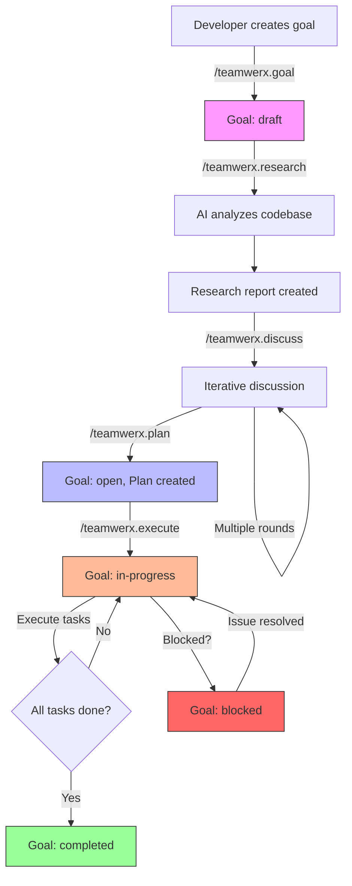

# teamWERX Specification

## Introduction

teamWERX is a development framework for individual developers working with multiple AI agents. It provides a structured workflow to bring clarity, predictability, and efficiency to the software development lifecycle by coordinating the developer and their AI assistants around shared goals and plans.

## Core Philosophy

*   **Goal-Oriented:** Development starts with a clear definition of high-level goals and desired outcomes.
*   **Specification-Driven:** Goals are translated into concrete specifications through a process of research and discussion with AI agents.
*   **Multi-Agent Coordination:** The framework orchestrates multiple AI agents working on different aspects of a project, all guided by a single developer.
*   **Traceability:** All decisions, discussions, and plans are documented and version-controlled, providing a clear audit trail.
*   **Token-Efficient:** Agent instructions are designed to minimize token usage while providing complete context.

## Quick Start

```bash
# Install and initialize
npm install -g teamwerx
cd my-project && git init
teamwerx init

# Create and develop a goal
teamwerx goal "Implement user authentication"
teamwerx research
teamwerx discuss "Should we use JWT or sessions?"
teamwerx plan
teamwerx execute    # Executes tasks one-by-one

# Multi-agent coordination: see Common Workflows section
```

## Technical Architecture

teamWERX will be built as a command-line interface (CLI) tool using Node.js. It will be distributed via npm, allowing for easy installation and integration into existing projects. The CLI will provide a set of slash commands for interacting with the framework.

## Workflow

The teamWERX workflow is divided into four main phases. Multiple goals can progress through these phases concurrently, with different AI agents potentially working on different goals under the developer's direction.

1.  **Goal Setting:** The developer defines the high-level goals for the project or feature.
2.  **Research and Discussion:** The developer and AI agents research the existing codebase, discuss potential implementation strategies, and refine the requirements.
3.  **Planning:** Based on the research and discussion, a detailed implementation plan is created.
4.  **Execution:** The plan is executed by AI agents under the developer's guidance.
5.  **Change Management:** Changes to goals and plans can be proposed and tracked throughout the development process.

**Note:** These phases are per-goal, meaning different goals can be in different phases simultaneously, with different AI agents working on different goals.

### Workflow Visualization

The following diagram shows the complete lifecycle of a goal in teamWERX:



**Key Points:**
*   Goals start in `draft` state and progress through research and planning
*   The discussion phase is iterative (multiple rounds possible)
*   Execution moves the goal to `in-progress`
*   Tasks are executed one-by-one until all complete
*   Goals can be blocked and later unblocked

### Research and Discussion

**Understanding the Difference:**

These two commands serve distinct purposes in the workflow:

**`/teamwerx.research [goal-name] [--note <text>] [--file <path>] [--url <url>]`** - Session-Based Analysis
*   **Purpose**: Capture deep understanding of the codebase and surrounding context for a goal/plan/proposal without overwriting prior research.
*   **When**: Execute once after creating a goal and again whenever fresh findings are required. Every invocation creates a new session.
*   **Output**: Structured artifacts in `.teamwerx/research/[artifact]/session-<timestamp>/` (e.g., `report.md`, additional files, session notes).
*   **AI Action**: Read and analyze the codebase, search the web for current guidance (when network access is available), ingest any supplemental notes/files/URLs passed through the CLI flags, identify relevant files/functions/patterns, and document findings inside the session directory.
*   **Example**: "Analyze the existing authentication system and identify integration points"

**`/teamwerx.discuss [message]`** - Iterative Conversation
*   **Purpose**: Multi-round conversation to refine implementation approach
*   **When**: After research, potentially multiple times before planning
*   **Output**: Appends to `.teamwerx/research/[artifact]/discussion.md` (defaults to the current goal)
*   **AI Action**: Respond to developer's questions, propose alternatives, provide feedback
*   **Example**: `/teamwerx.discuss "Should we use JWT or session-based auth?"`

Both commands conceptually apply to any artifact that needs collaborative analysis—not only active goals. When an AI agent needs to explore a downstream plan or a proposal, they should still invoke the appropriate command but capture the output inside a dedicated `.teamwerx/research/[artifact-id]/` folder (and clearly state which artifact is being discussed) so that context stays grouped. `/teamwerx.research` may include supplementary sources (URLs, documents, raw text) appended by the developer; the CLI copies those attachments into the session’s `inputs/` directory, and agents must ingest them alongside their own web searches so findings reflect all supplied material.

**Recommended Flow:**
```bash
teamwerx goal "Implement authentication"
teamwerx research                              # AI analyzes codebase once
teamwerx discuss "Which auth library works best with our stack?"
teamwerx discuss "How should we handle refresh tokens?"
teamwerx discuss "Let's proceed with JWT and refresh tokens"
teamwerx plan                                  # Generate implementation plan
teamwerx archive implement-auth                # Archive artifacts after deployment
```

## Commands

All AI-facing commands are **non-destructive**. Instead of overwriting existing artifacts, they append new entries, create timestamped session folders, or add addenda so prior context remains available in git history.

### Initialization

*   `/teamwerx.init`: Initializes teamWERX in the current project. This command:
    *   Verifies that the current directory is a git repository (fails if not)
    *   Creates the `.teamwerx` directory structure
    *   Creates template directories for goals, research, plans, and proposals
    *   Creates or updates `AGENTS.md` with teamWERX configuration in YAML frontmatter
    *   Outputs a success message with next steps

**Prerequisites:**
*   The project must be initialized as a git repository (`git init` must have been run)
*   The command must be run from the project root directory

**Error Handling:**
*   If git is not initialized, the command will display: "Error: teamWERX requires a git repository. Please run 'git init' first."
*   If `.teamwerx` already exists, the command will ask: "teamWERX is already initialized. Do you want to reinitialize? (y/n)"
*   If `AGENTS.md` already exists, the command will preserve existing content and add/update only the frontmatter configuration

### Goal Setting

*   `/teamwerx.goal [goal description]`: Creates a new goal and prompts for success criteria. The description is a string that describes the goal.

### Goal Management

*   `/teamwerx.list [--status=<status>]`: Lists all goals in the project with optional filtering by status.
*   `/teamwerx.status [goal-name]`: Shows detailed status of a specific goal, or all goals if no name is provided.
*   `/teamwerx.use [goal-name]`: Sets the current working goal context for subsequent commands.

### Research and Discussion

*   `/teamwerx.research [goal-name] [--note <text>] [--file <path>] [--url <url>]`: Analyzes the codebase, searches the web for supporting information, and stores any supplemental resources (links, files, pasted text) provided with the command. Each invocation creates a new session folder under `.teamwerx/research/[artifact]/session-<timestamp>/` so prior research is preserved.
*   `/teamwerx.discuss <message>`: Facilitates a structured discussion. Mention which goal, plan, or proposal the conversation concerns and append timestamped entries to the matching research subdirectory instead of overwriting existing discussion.
*   `/teamwerx.dry-run`: Simulates the implementation plan to identify potential issues before execution.

### Change Management

*   `/teamwerx.propose [description]`: Propose a change to a goal or plan. The description is a string that describes the proposed change. Proposals are reviewed manually—update the proposal file’s `status` (e.g., `approved`, `rejected`) and rationale directly once a decision is made.
*   `/teamwerx.plan`: Generates a task list based on the research and discussion.

### Archiving

*   `/teamwerx.archive [goal-name] [--yes]`: Archives a completed goal (defaults to the current goal). Moves the goal file, plan, research sessions, and proposals into `.teamwerx/archive/` while ensuring existing files are not overwritten. Use `--yes` to skip confirmation prompts.

### Execution

*   `/teamwerx.execute [task-id]`: Executes a specific task from the current plan.
    *   If `task-id` is provided, executes that specific task
    *   If no `task-id` is provided, executes the next pending task
    *   Updates task status to `in-progress` → `completed`
    *   Prompts developer to review changes and commit

**Execution Flow:**
1. CLI reads the current plan from `.teamwerx/plans/[goal].md`
2. CLI identifies the task by ID (or finds next pending task)
3. CLI outputs task context for the AI agent
4. AI agent implements the task, creating or modifying code files
5. CLI updates task status to `completed` in the plan file
6. CLI prompts developer to review and commit changes

**Example:**
```bash
$ teamwerx execute 1

Executing Task 1: Create login form component
Goal: implement-auth
Plan: .teamwerx/plans/implement-auth.md

[AI agent creates LoginForm.tsx, adds tests, updates imports...]

Task 1 completed successfully.
Review changes and commit:
  git add .
  git commit -m "[teamWERX] Create login form component"
```

## Error Handling

Commands provide clear, actionable error messages that include:
1. What went wrong
2. How to fix it
3. Relevant context (available options, next steps)

**Common error categories:**
- Prerequisites not met (git not initialized, teamWERX not initialized)
- Resource not found (invalid goal/task/proposal ID)
- State errors (no current goal set, no pending tasks)

## Project Structure

teamWERX uses two main locations for its files:

1. **Project Root**: Contains `AGENTS.md` (configuration and agent instructions)
2. **`.teamwerx` Directory**: Contains all artifacts (goals, plans, research, etc.)

### Root Level
```
project-root/
├── AGENTS.md          # Configuration + AI agent instructions
└── .teamwerx/         # teamWERX artifacts directory
```

### `.teamwerx` Directory Structure

The `.teamwerx` directory is created in the root of the project to store all teamWERX artifacts:

```
.teamwerx/
├── goals/
│   ├── goal-1.md
│   └── goal-2.md
├── research/
│   ├── goal-1/
│   │   ├── discussion.md
│   │   ├── session-2025-01-15T10-10-10-000Z/
│   │   │   ├── inputs/
│   │   │   │   └── note-2025-01-15.md
│   │   │   └── report.md
│   │   └── session-2025-01-20T14-05-30-000Z/
│   │       ├── inputs/
│   │       └── report.md
│   └── goal-2/
│       ├── discussion.md
│       └── session-2025-02-01T09-00-00-000Z/
│           └── report.md
├── plans/
│   ├── goal-1.md
│   └── goal-2.md
├── proposals/
│   ├── goal-1/
│   │   ├── proposal-1.md
│   │   └── proposal-2.md
│   └── goal-2/
│       └── proposal-1.md
├── archive/
│   ├── goals/
│   ├── plans/
│   ├── research/
│   └── proposals/
└── .current-goal
```
*   `goals/`: Contains the markdown files for each goal.
*   `research/`: Contains discussion logs plus timestamped session folders (with reports, inputs, URLs, etc.). Each goal, plan, or proposal gets its own subdirectory (e.g., `research/goal-1/`, `research/goal-1-plan/`, `research/goal-1-proposal-2/`).
*   `plans/`: Contains the implementation plans for each goal.
*   `proposals/`: Contains change proposals for goals and plans.
*   `archive/`: Stores archived copies of goals, plans, research, and proposals.
*   `.current-goal`: Tracks the currently active goal (simple text file).

### Configuration

teamWERX configuration is stored in the `AGENTS.md` file at the project root. This file serves both as documentation for AI agents and as the configuration source for teamWERX behavior. By consolidating configuration into a human-readable markdown file, it ensures that the developer and all AI agents have a single source of truth.

**Location**: `AGENTS.md` (project root)

The configuration is defined using minimal YAML frontmatter at the top of the AGENTS.md file:

```yaml
---
teamwerx:
  version: "1.0.0"
  initialized: "2025-10-25"
---
```

**Configuration Fields:**
*   `version`: teamWERX specification version
*   `initialized`: ISO 8601 date when teamWERX was initialized

**Note on Token Efficiency:** The configuration is intentionally minimal because AGENTS.md is read by AI agents with every command execution. Additional settings are defined as conventions in the specification rather than configuration (e.g., default goal status is always "draft", git is always enabled, commits are always manual, commit prefix is always "[teamWERX]").

## Core Concepts & Schemas

**Goal:** High-level statement of what to achieve ("what" and "why"). Includes success criteria.

**Plan:** Detailed steps to achieve a goal ("how"). Generated from goal through research and discussion.

**Proposal:** Suggested change to a goal or plan.

**Artifact schemas:** All artifacts use YAML frontmatter for machine-readability (see schemas below).

## Versioning

teamWERX uses git-based versioning for all artifacts. Manual commits with `[teamWERX]` prefix recommended.

**Version references:** Commit SHAs, tags, or branches (e.g., `a1b2c3d`, `v1.0.0`, `HEAD~1`)

**Git workflow:**
- Commit: `.teamwerx/goals/`, `.teamwerx/plans/`, `.teamwerx/research/`, `.teamwerx/proposals/`, `.teamwerx/archive/`, `AGENTS.md`
- Ignore: `.teamwerx/.current-goal`, `.teamwerx/.temp/` (see .gitignore)

## Goal State Management

Goals in teamWERX progress through a defined set of states during their lifecycle. Understanding these states and their transitions helps teams track progress and manage their workflow effectively.

### Goal States

*   **draft**: Initial state when a goal is created but not yet ready for work. The goal may still be under discussion or refinement.
*   **open**: The goal is defined and ready to be worked on, but work has not yet started.
*   **in-progress**: Active work is being done on the goal.
*   **blocked**: Work on the goal is temporarily halted due to dependencies, issues, or other impediments.
*   **completed**: The goal has been achieved and all success criteria have been met.
*   **cancelled**: The goal has been abandoned and will not be completed.

### State Transitions

See "Workflow Visualization" section for complete state flow diagram.

**State changes:** Update frontmatter `status` field manually, then commit to git.

**Plan/Task states:**
- Plans: `pending` → `in-progress` → `completed` (or `blocked`)
- Tasks: `pending` → `in-progress` → `completed`
- Plan status automatically reflects task statuses

## Multi-Goal Development

Supports unlimited concurrent goals, each with independent workflows. Different AI agents can work on different goals in parallel.

**Goal identification:** Kebab-case filenames (e.g., `implement-new-login-page.md`)

**Context management:**
- `/teamwerx.use [goal-name]` - Set current working goal (stored in `.teamwerx/.current-goal`)
- `/teamwerx.list [--status=<status>]` - List/filter all goals
- `/teamwerx.status [goal-name]` - Show detailed goal status

**Dependencies:** Add `dependencies` field in goal frontmatter to track prerequisite goals

## Proposal Workflow

A **proposal** is a suggested change to a goal or a plan. It is a structured way to propose changes and track the decision-making process. Proposals are stored in the `.teamwerx/proposals` directory.

The following is a recommended workflow for managing proposals:

1.  A user creates a proposal using the `/teamwerx.propose` command.
2.  The proposal is saved as a markdown file in the `.teamwerx/proposals` directory with a status of "pending".
3.  Other users can then review the proposal and provide feedback in the discussion thread.
4.  Once the discussion is complete, the developer (or designated reviewer) updates the proposal file directly, setting `status` to `approved` or `rejected` and documenting the rationale.
5.  If the proposal is approved, apply the changes to the corresponding goal or plan, then archive the proposal for reference.
6.  If the proposal is rejected, archive the proposal (with the rejection rationale) for future reference.

## Archiving

Use `/teamwerx.archive [goal-name]` to move completed work out of the active workspace:

1. The CLI looks up the goal (defaults to the current goal).
2. It shows a summary of the artifacts to be moved (goal, plan, research directory, proposals) and asks for confirmation unless `--yes` is provided.
3. Each artifact is moved into `.teamwerx/archive/<type>/`, automatically appending suffixes if files already exist.
4. If the archived goal was set as the current goal, `.teamwerx/.current-goal` is cleared.

Archived goals no longer appear in `/teamwerx.list`, but they remain in `.teamwerx/archive/` (and git history) for auditing.

## AI Agent Integration

teamWERX integrates with AI agents through `AGENTS.md`, which contains both configuration (YAML frontmatter) and command instructions.

**AI-agnostic design:** teamWERX doesn't call AI APIs. AI agents read `AGENTS.md` to understand commands and execute accordingly.

**Agent workflow:** Read `AGENTS.md` → Understand command → Execute action → Create/modify artifacts

### Goal Schema

| Field | Type | Required | Description |
|-------|------|----------|-------------|
| `title` | string | ✓ | Brief, descriptive name |
| `status` | enum | ✓ | draft \| open \| in-progress \| blocked \| completed \| cancelled |
| `created` | date | ✓ | ISO 8601 date (YYYY-MM-DD) |
| `success_criteria` | array | ✓ | List of measurable outcomes |
| `dependencies` | array | - | Goal IDs that must complete first (optional) |

### Plan Schema

| Field | Type | Required | Description |
|-------|------|----------|-------------|
| `goal` | string | ✓ | Goal file reference (without .md) |
| `status` | enum | ✓ | pending \| in-progress \| completed \| blocked |
| `tasks` | array | ✓ | Task objects: `{id, description, status}` |

**Task object:** `{id: number, description: string, status: pending | in-progress | completed}`

### Proposal Schema

| Field | Type | Required | Description |
|-------|------|----------|-------------|
| `title` | string | ✓ | Brief description of proposed change |
| `type` | enum | ✓ | goal-change \| plan-change |
| `target` | string | ✓ | Goal or plan ID this affects |
| `status` | enum | ✓ | pending \| approved \| rejected |
| `created` | date | ✓ | ISO 8601 date (YYYY-MM-DD) |
| `rationale` | string | ✓ | Why this change is proposed |

**Body sections:** Proposed Changes, Impact, Alternatives Considered (markdown format)

## Common Workflows

**Complete Goal Lifecycle:**
```bash
teamwerx goal "..." → research → discuss "..." → plan → execute 1..N → archive
git add . && git commit -m "[teamWERX] ..."  # After each task/archive
# Update goal status whenever state changes
```

**Multi-Agent Coordination:**
```bash
# Agent A (session 1)
teamwerx use goal-a && teamwerx research && teamwerx execute

# Agent B (session 2, different terminal)
teamwerx use goal-b && teamwerx research && teamwerx execute

# Check all goals
teamwerx list
```

**Change Management:**
```bash
teamwerx propose "..." → review & update proposal status manually → teamwerx plan
```

## Best Practices

**Git Workflow:**
- Commit after each major change (goal creation, plan updates, task completion)
- Use `[teamWERX]` prefix for commit messages
- Tag important milestones with git tags
- Create branches for experimental goals

**Goal Management:**
- Use clear, distinctive goal names to avoid confusion between agents
- Track dependencies in goal frontmatter when goals depend on each other
- Regularly review all goals with `/teamwerx.list`
- Archive completed goals to keep workspace focused
- Limit number of goals in `in-progress` state simultaneously

**Multi-Agent Coordination:**
- Each agent works on one goal at a time (set with `/teamwerx.use`)
- Use separate terminal sessions/IDEs for different agents
- Review overall status with `/teamwerx.list` before switching contexts
- Document blockers in goal status when work is halted

**Research & Discussion:**
- Run `/teamwerx.research` once per goal (initial analysis)
- Use `/teamwerx.discuss` for iterative conversations (multiple rounds)
- Follow recommended flow: goal → research → discuss → plan → execute → archive

## Extensibility

teamWERX will be designed to be extensible. Users will be able to add new commands and new types of artifacts to the framework. New commands can be added by creating a new javascript file in the `commands` directory. New artifact types can be added by creating a new directory in the `.teamwerx` directory.
